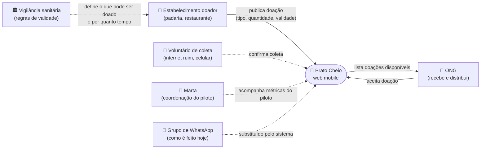
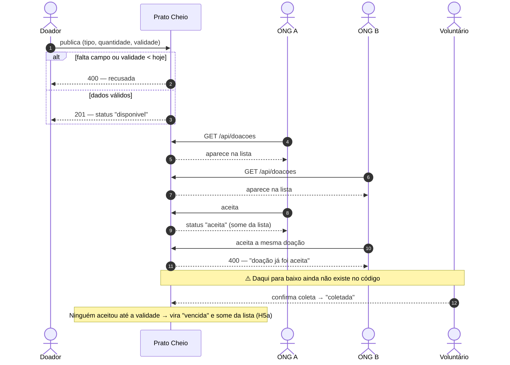
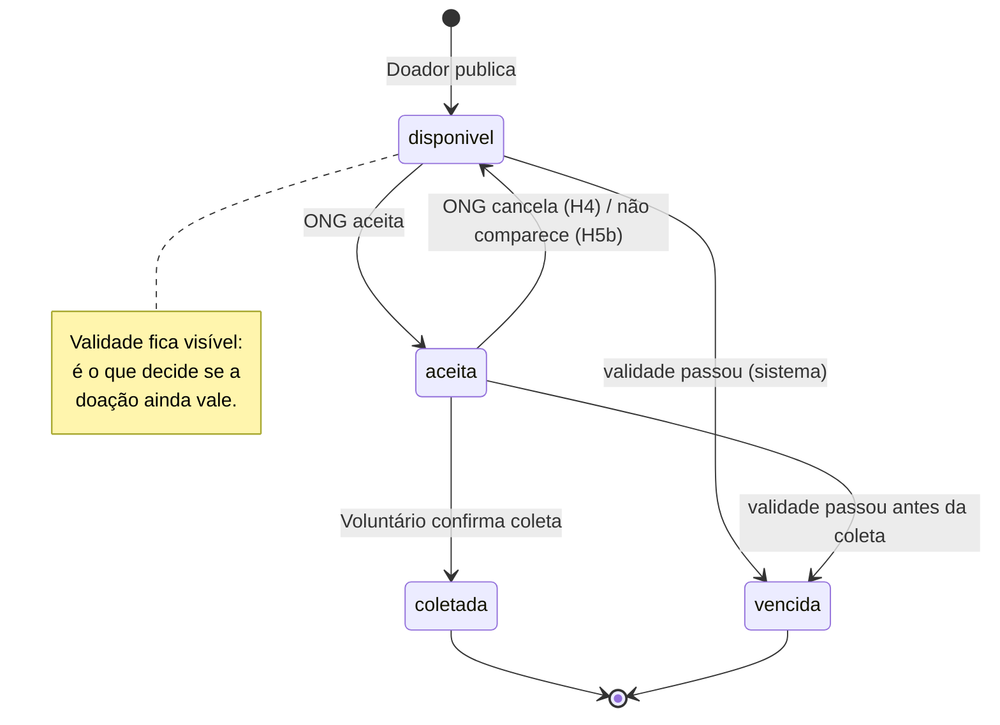
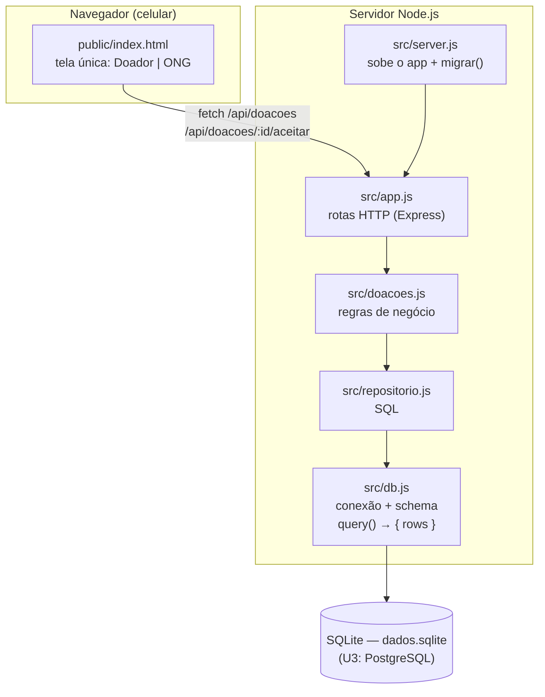
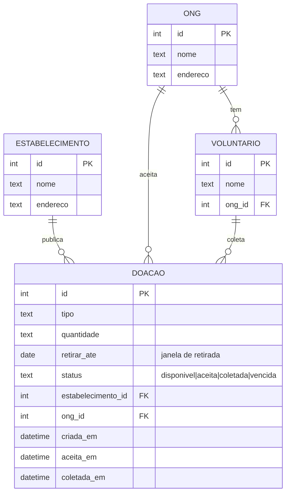
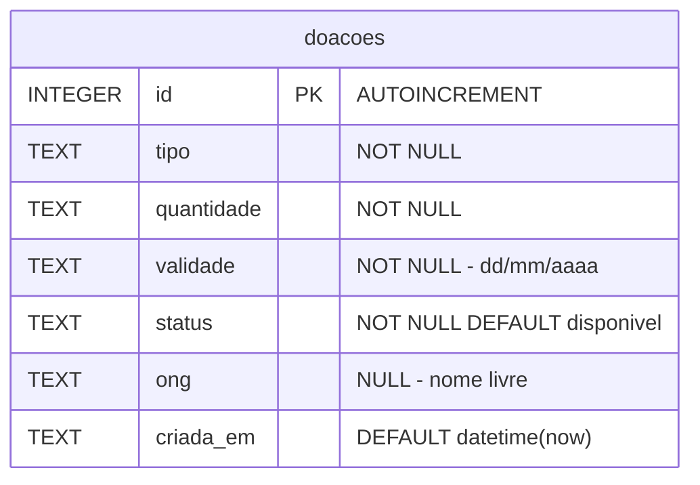

# Diagramas — Prato Cheio

*Aula 07 · Modelagem e diagramas · nível de IA: IA como colaboradora*

Cada diagrama abaixo responde **uma** pergunta. Os diagramas estão em [Mermaid](https://mermaid.js.org/)
(texto), então o GitHub os desenha direto nesta página e eles são versionados junto com o código.

| # | Diagrama | Pergunta que responde |
|---|---|---|
| 1 | Contexto | Quem usa o sistema e com o que ele conversa? |
| 2 | Fluxo principal (sequência) | Por onde passa a história zero — e onde ela pode falhar? |
| 3 | Estados da doação | Em que situação uma doação pode estar e quem a muda? |
| 4 | Componentes | Quais partes existem por dentro? |
| 5 | Dados (caso × `db.js`) | O que guardamos e como se liga? |

Legenda usada em todos: **linha cheia** = já existe no código; **linha tracejada** = está no caso
(`docs/analise.md`), mas ainda não existe no produto.

---

## 1. Contexto — quem usa e com o que conversamos

**Leitura:** hoje o sistema só conversa com dois atores (doador e ONG). O voluntário e a Marta estão
no caso, mas não têm tela nem rota. A vigilância sanitária **não usa** o sistema — ela aparece porque
é a origem da regra de validade, que é o coração do problema (comida perecível com janela curta).

---

## 2. Fluxo principal — a história zero, com os pontos de falha

**Onde pode falhar** (o "modelo honesto" da aula):

| Ponto | Falha | Tratado hoje? |
|---|---|---|
| 1 | Doação sem tipo/quantidade/validade, ou com validade no passado | ✅ `criarDoacao` recusa |
| 9–10 | Duas ONGs aceitam ao mesmo tempo | ✅ `UPDATE ... WHERE status = 'disponivel'` (decisão #2 do `projeto.md`) |
| — | Doação vence sem ninguém aceitar e continua aparecendo na lista | ✅ H5a: some da lista, vira `vencida` e não pode ser aceita |
| — | ONG aceita e não aparece para coletar | ❌ não tratado (H5b) |
| — | Coleta não é registrada → não dá para medir "publicação → coleta" | ❌ não tratado |

---

## 3. Estados da doação — e quem faz cada passo

| Estado | Existe no `db.js`? |
|---|---|
| `disponivel` | ✅ valor padrão da coluna `status` |
| `aceita` | ✅ gravado por `repositorio.aceitar` |
| `vencida` | ✅ gravado por `repositorio.marcarVencida` (H5a) — só a partir de `disponivel`; `aceita → vencida` ainda não |
| `coletada` | ❌ nenhum código grava esse valor |

---

## 4. Componentes — as partes de dentro

**Por que esta divisão importa:** a troca SQLite → PostgreSQL da Unidade 3 deve mexer só em
`db.js` (e no SQL específico de `repositorio.js`). As regras em `doacoes.js` não falam SQL, então
podem ser testadas e evoluídas sem saber qual banco está embaixo.

---

## 5. Dados — o modelo do caso confrontado com o `db.js` real

### 5a. Modelo do caso (o que a análise pede)

### 5b. Modelo real (`src/db.js`, função `migrar`)

O banco real tem **uma tabela só**. Tudo o que no caso é entidade (estabelecimento, ONG, voluntário)
ainda não existe ou virou texto solto.

### 5c. Divergências encontradas

| # | O diagrama do caso diz | O `db.js` real tem | Consequência | O que fazer |
|---|---|---|---|---|
| 1 | ONG é uma **entidade** ligada à doação | `ong TEXT` (nome livre). O front manda sempre `"Minha ONG"` e a rota usa `'ONG'` se vier vazio | "ONG Esperança" e "ong esperança" viram ONGs diferentes; não há como listar "minhas doações aceitas" de forma confiável | Criar tabela `ongs` + `ong_id` (junto com login/identificação, em história própria) |
| 2 | Doação **pertence a um estabelecimento** | Não existe coluna de autor | Impossível cumprir o critério de H4 ("o estabelecimento é notificado") ou mostrar ao doador as próprias doações | Criar `estabelecimentos` + `estabelecimento_id` |
| 3 | Estados `disponivel → aceita → coletada / vencida` | `status TEXT` sem `CHECK`; antes só `disponivel` e `aceita` eram gravados | O fluxo da aula (*publica → aparece → aceita → **coleta***) para em "aceita"; doação vencida continuava aparecendo como disponível | **Resolvido parcialmente pela H5a** (status `vencida`, sem mudar o schema); `coletada` fica para a próxima |
| 4 | **Janela** de retirada com data comparável | `validade TEXT` no formato `dd/mm/aaaa` | Não dá para ordenar nem comparar no SQL (`'01/12/2026' < '31/01/2026'` como texto). O front ainda trata `aaaa-mm-dd`, sinal de que o formato já mudou uma vez | Na migração para PostgreSQL (U3), trocar para `DATE` e converter na borda (API) |
| 5 | Medir **tempo entre publicação e coleta** (métrica do experimento em `analise.md`) | Só `criada_em`; não há `aceita_em` nem `coletada_em` | A métrica de sucesso do piloto (−30% no tempo publicação → coleta) **não pode ser calculada** com os dados guardados | Adicionar `aceita_em` e `coletada_em` |
| 6 | `quantidade` serve para estimar refeições | `quantidade TEXT` livre ("10 porções", "5 kg") | Não dá para somar refeições entregues (métrica complementar) | Separar em `quantidade NUMERIC` + `unidade` quando a métrica for priorizada |
| 7 | — | `criada_em DEFAULT (datetime('now'))` | Função específica do SQLite e em UTC; quebra na troca para PostgreSQL | Registrar no ADR da migração (U3): `DEFAULT now()` |
| 8 | — | `repositorio.buscarAceitaPorOng` existe e ninguém chama | Código morto que sugere uma regra ("uma ONG só pode ter uma doação aceita"?) que não está no caso | Decidir com o grupo: virar história ou remover |

**Conclusão do confronto:** o código cobre bem a disputa entre ONGs (o caminho feliz + a falha
mais óbvia), mas **o modelo de dados não enxerga o tempo**: não sabe quando a doação vence de fato,
nem quando foi aceita ou coletada. É justamente o risco nº 1 da análise ("doação perdida por atraso
na coleta"). Por isso a história escolhida para evoluir o produto nesta aula é a **H5a — doação
vencida sai da lista**.

### História nova — H5a: doação vencida sai da lista

> **Como** ONG, **quero** ver só doações que ainda estão dentro da validade **para que** eu não
> perca uma viagem até um alimento que já não pode ser doado.

**Critérios de aceite** (todos em `tests/doacoes.test.js`, bloco `doação vencida`):

- Dada uma doação disponível cuja validade já passou, quando uma ONG lista as doações, então ela
  **não aparece** e fica registrada com status **`vencida`**.
- Dada uma doação vencida, quando uma ONG tenta aceitá-la, então recebe **400 — "doação vencida"**.
- Dada uma doação cuja validade é **hoje**, quando uma ONG lista, então ela **ainda aparece**
  (a validade vale até o fim do dia).

**Decisão:** a marcação é feita "preguiçosamente" na hora de listar/aceitar, em `doacoes.js`, em
vez de um job agendado (alternativa B da decisão #3 do `projeto.md`). Assim não precisa de
infraestrutura nova, a comparação de datas fica em JavaScript (o `validade` em texto não compara
no SQL — divergência 4) e nada muda no schema, então a migração para PostgreSQL não é afetada.
Custo: uma doação vencida que ninguém consulta continua `disponivel` no banco até a próxima listagem.

---

## Uso de IA

Os rascunhos dos cinco diagramas foram gerados com IA (Claude Code) a partir de `docs/analise.md`,
`docs/projeto.md` e do código em `src/`. O que conferimos e mudamos em relação a um diagrama
"genérico de marketplace":

- **Incluímos a vigilância sanitária** no contexto, como fonte da regra de validade (ela não usa o
  sistema, mas sem ela a janela de validade não teria motivo de existir).
- **Deixamos a validade e os estados intermediários visíveis** (`vencida`, `coletada`) e marcamos
  com linha tracejada tudo o que está no caso mas não no código — em vez de desenhar só o caminho
  que dá certo.
- **O modelo de dados foi conferido linha a linha contra `migrar()` em `src/db.js`**; a tabela de
  divergências saiu dessa comparação, não do rascunho.

> Antes de entregar, cada integrante deve conseguir explicar qualquer seta destes diagramas.
